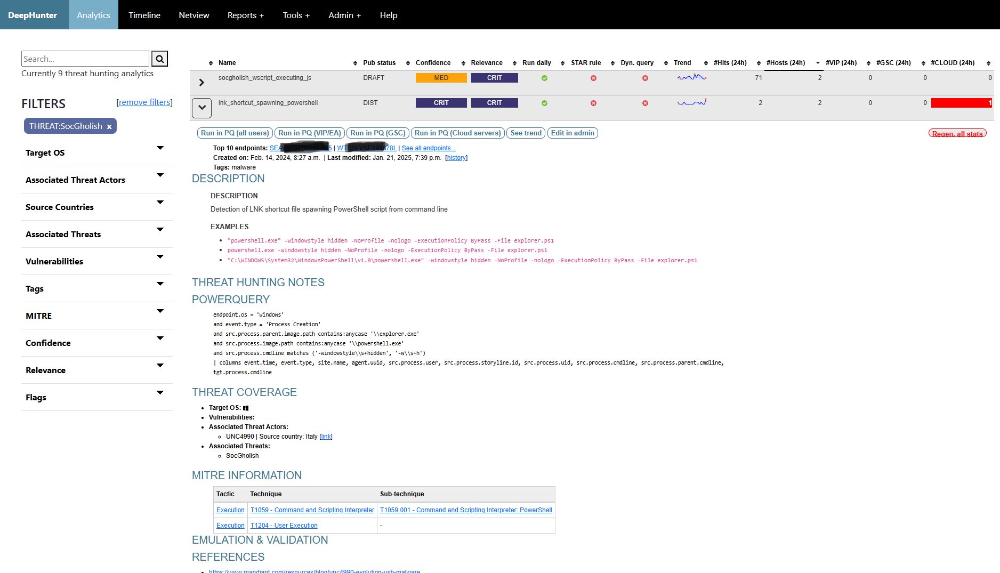
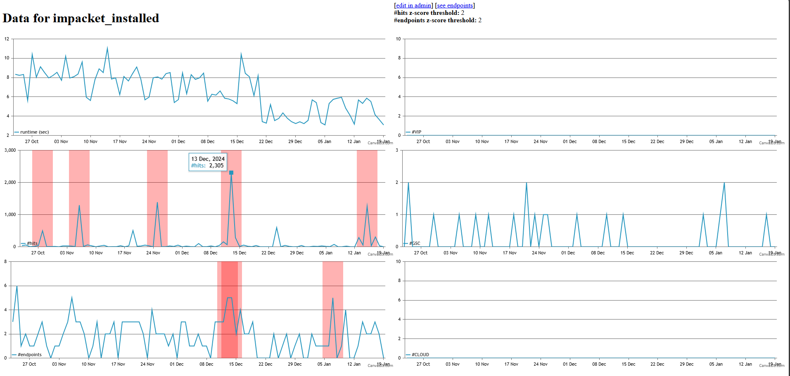
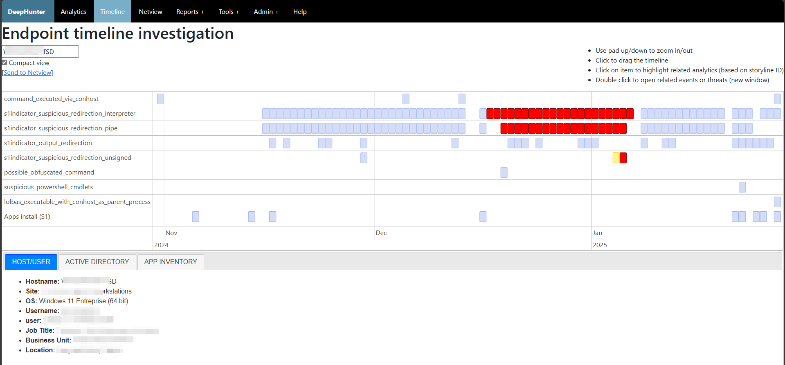
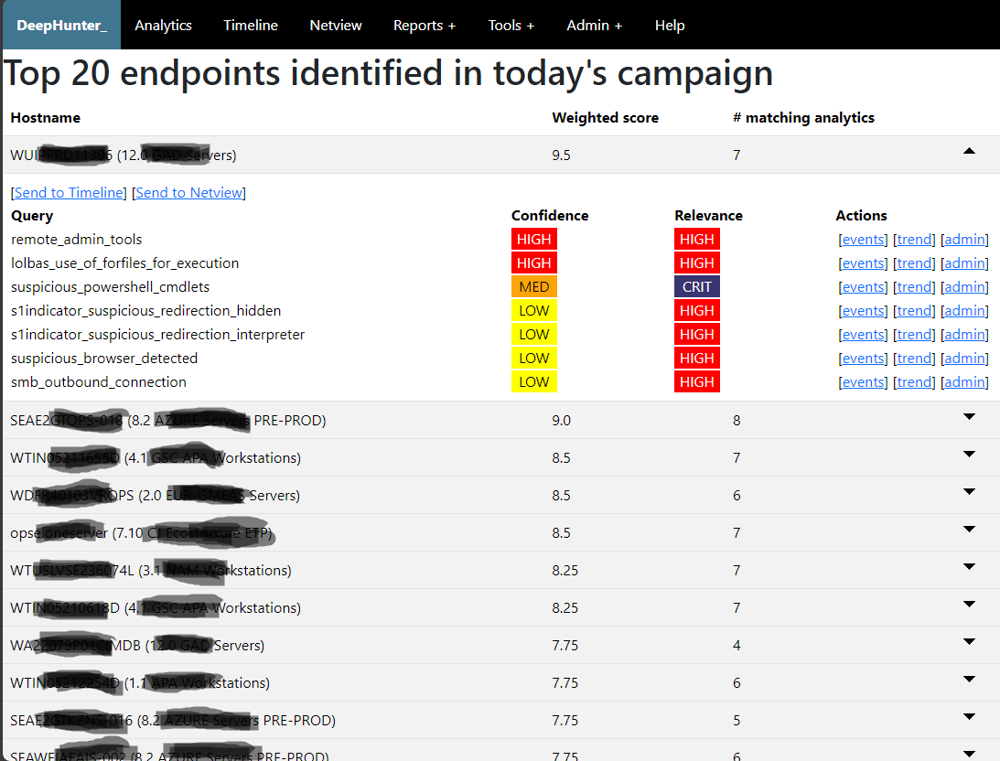
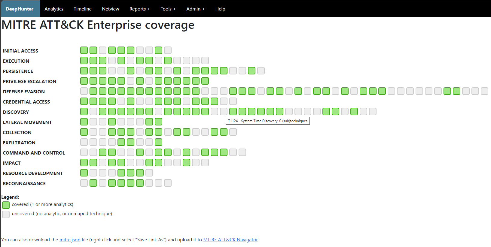
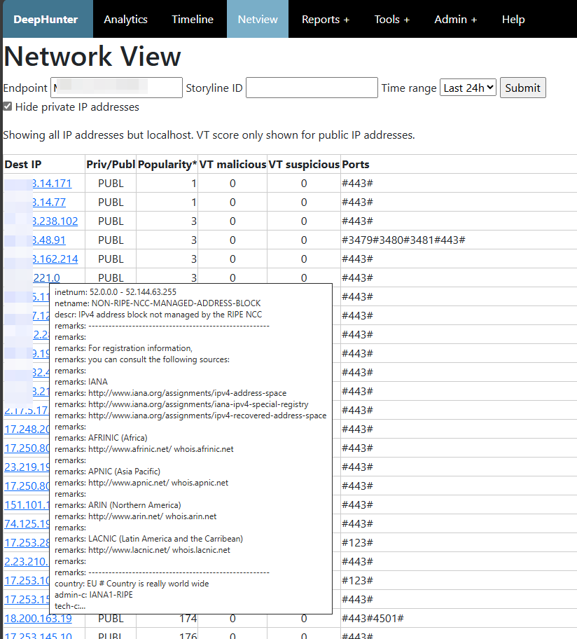
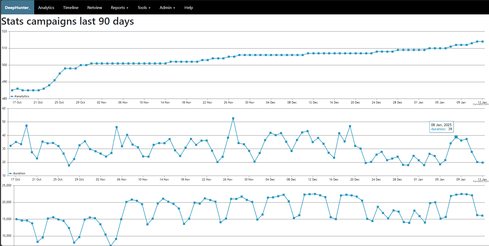
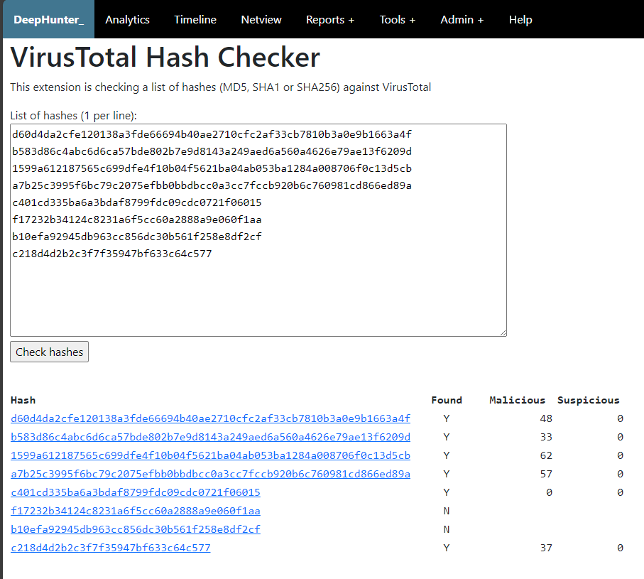
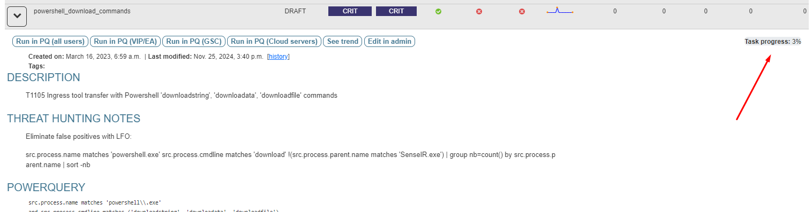

.. DeepHunter documentation master file, created by
   sphinx-quickstart on Sat Dec 14 08:10:40 2024.
   You can adapt this file completely to your liking, but it should at least
   contain the root `toctree` directive.

Introduction
############

What is DeepHunter?
*******************
DeepHunter is a Threat Hunting platform that features:

- `Repository <usage_analytics.html>`_ for your threat hunting analytics shown in a sortable table.
- `Search and filters <usage_analytics.html#id4>`_ (description, threat hunting notes, tags, query, OS coverage, vulnerabilities, threat actors, threat names, MITRE coverage, etc.) to find particular threat hunting analytics or group them into hunting packages.
- `Automated execution <index.html#campaigns>`_ of threat hunting queries in daily campaigns and collection of daily statistics (number of matching events, number of matching endpoints, etc).
- `Trend analysis <usage_trend.html>`_ with automatic detection of statistical anomalies.
- `Timeline view <usage_timeline.html>`_ of the distribution of threat hunting analytics for a given endpoint.
- `Network view <usage_netview.html>`_ module to analyze network activities from a host, with highlights on the destination popularity (based on your environment) and VirusTotal reputation.
- Reports (`Campaigns performance report <reports_stats.html>`_, `Top endpoints identified in the last campaign <reports_endpoints.html>`_, `MITRE coverage <reports_mitre_coverage.html>`_, `List of analytics with missing MITRE coverage <reports_missing_mitre.html>`_)
- Tools (`LOL Driver Hash Checker <tools_lol_drivers_hash_checker.html>`_, `VirusTotal Hash Checker <tools_vt_hash_checker.html>`_, `Whois <tools_whois.html>`_).

Who is DeepHunter for?
**********************
DeepHunter is an application developed by threat hunters for threat hunters, in order to automate the execution of threat hunting queries, and prioritize threat hunts. It is not intended to replace the EDR itself. Targeted populations are:

- **Threat Hunters**: DeepHunter may quickly become your day-to-day threat hunting platform.
- **SOC analysts**: DeepHunter timeline module can help you triage incidents, or correlate a reported incident with other artifacts.
- **Incident Responder/Analyst**: DeepHunter timeline can show you since when a particular behavior exists, whether it has been identified as a threat by your EDR, whether it could be linked to an installed application, etc..

What EDR are supported?
***********************
DeepHunter has been designed to connect to the **`SentinelOne <https://www.sentinelone.com/>`_ EDR**, and queries associated to the analytics are expected to be using the **PowerQuery** language.

However, DeepHunter may be able to connect to other EDR, provided you adapt the code. You are very welcome to contribute.

Architecture
************
.. image:: img/deephunter_architecture.jpg
  :width: 600
  :alt: DeepHunter architecture diagram

Campaigns and Statistics
########################

Campaigns
*********
The purpose of DeepHunter is to automate the execution of threat hunting analytics (the ones with the ``run_daily`` flag set) each day. This is done through campaigns.

Campaigns are cron jobs running every day at the same time. They execute the analytics, and collect statistics (number of matching events, number of endpoints, etc.) for each analytic every day for the last 24 hours, creating a baseline (trend analysis) for each analytic. A model based on z-score is then applied to these statistics to identify statistical anomalies.

Statistics regeneration
***********************
It may happen that you modify a threat hunting query for various reasons (e.g., add a filter to exclude some results). When you do so, statistics for the updated query will change. If you want to apply the same logic to all past statistics, as if the query would have always been as you just changed it, you can regenerate the statistics for this threat hunting query. It will work on the background and show the percentage of completion as shown below.

Static vs Dynamic analytics
***************************

By default, threat hunting analytics you will create in DeepHunter will be static. They will match a hunting query that is stored in the database, and that will be executed daily by the campaigns cron job.

However, it may happen that a hunting query needs to be dynamically generated. DeepHunter is shipped with an example (``vulnerable_driver_name_detected_loldriver``) of such a query. The query for this analytic is dynamically built from a script (``./qm/scripts/vulnerable_driver_name_detected_loldriver.py``) that runs prior to each campaign. This hunting query is built from an updated list of file names matching known vulnerable drivers, published on the LOLDriver website.

Dynamic queries should have the ``Dyn. query`` flag enabled (which is just an indication, there is no control associated to this flag), to indicate that they should not be manually edited in DeepHunter. Modifications should be done through their corresponding scripts directly.

DeepHunter Modules and Tools
############################

Modules
*******
DeepHunter comes with several modules that are particularly useful for threat hunters and incident responders:

- the `timeline view <usage_timeline.html>`_ shows the distribution of matching analytics accross campaigns for a particular host. For each match, a box will be shown for the given date, and double clicking on it will replay the query directly in your EDR, for the selected date. Each day, campaigns will also gather the storylineID information (a special information collected by SentinelOne), which is used to highlight analytics with the same storylineID in the timeline.
- the `trend analysis <usage_trend.html>`_ module is composed of graphs showing the distribution of the number of hits, and number of endpoints, with various filters (defined by the `CUSTOM_FIELDS <settings.html#custom-fields>`_ property) over time. It quickly allows the threat hunter to understand how frequent a threat hunting analytic triggers. A mathematical model is applied to the series to highlight potential statistical anomalies.
- the `netview (network view) <usage_netview.html>`_ module shows the list of network outbound connections for a particular host or storylineID. For each IP address, the popularity (number of endpoints in your environment where this destination is contacted) is shown, and for public IPs, a whois information is available, as well as the VirusTotal IP reputation.

Tools
*****
Besides the modules, there are also some tools, and it's easy to `develop your own <tools_develop_your_own.html>`_:

- `VirusTotal Hash Checker <tools_vt_hash_checker.html>`_: takes a list of file hashes and compares each against the VirusTotal database.
- `LOLDriver Hash Checker <tools_lol_drivers_hash_checker.html>`_: check a list of hashes against the LOLDriver database to confirm whether they correspond to vulnerable drivers.
- `Whois <tools_whois.html>`_: Whois module developed in Python.

Contents
########

.. toctree::
   :maxdepth: 2
   :caption: Contents:
  
   intro
   install
   scripts
   authentication
   settings
   usage_login_and_menu
   usage_analytics
   usage_trend
   usage_timeline
   usage_netview
   reports_stats
   reports_endpoints
   reports_mitre_coverage
   reports_missing_mitre
   tools_lol_drivers_hash_checker
   tools_vt_hash_checker
   tools_whois
   tools_develop_your_own
   admin
   support
