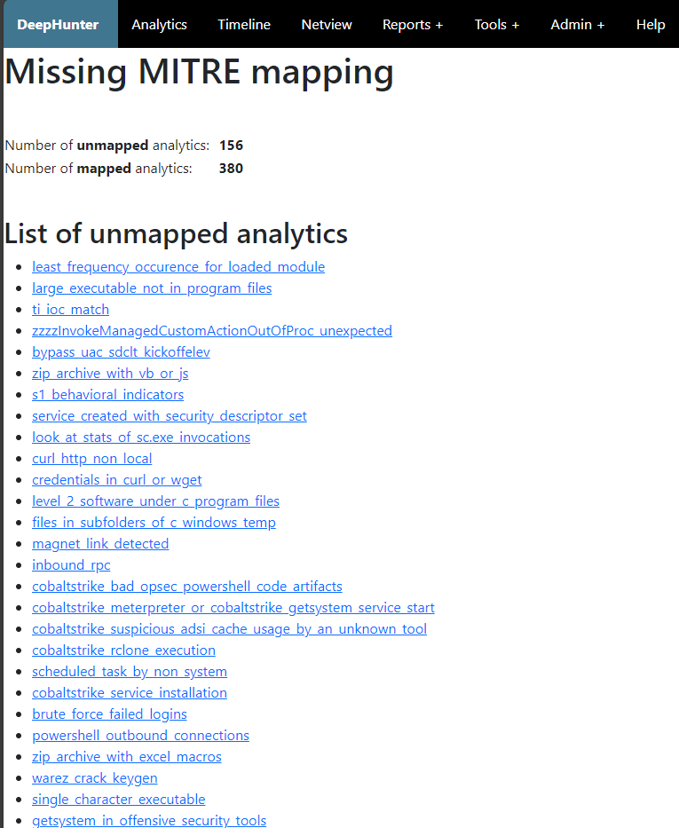

Reports: Missing MITRE mapping
##############################

MITRE is a standard used by every threat hunters, and it is important that threat hunting analytics you create in DeepHunter are correctly mapped. This report shows the list of threat hunting analytics that are missing the MITRE mapping.

