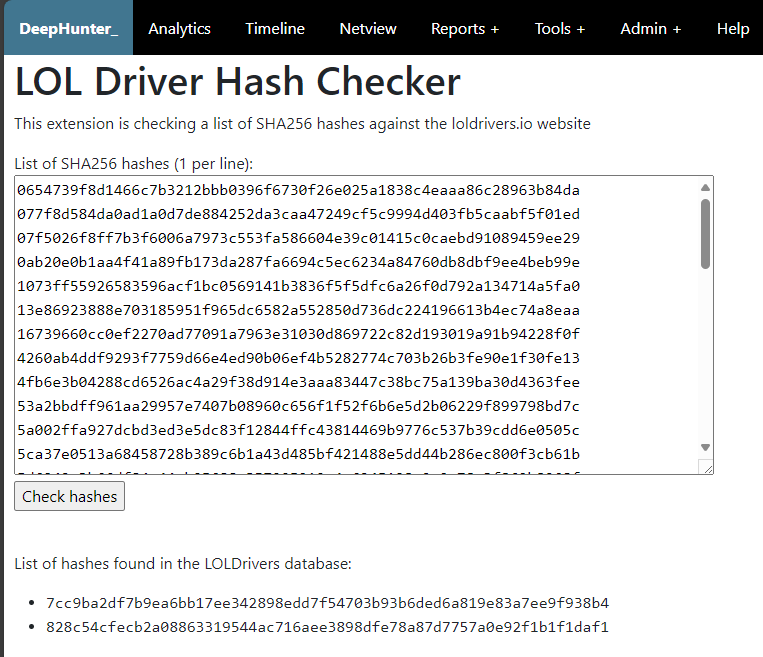

Tools: LOL Driver Hash Checker
##############################

Description
***********
This tool takes a list of SHA256 hashes and compares them to the `LOL Drivers <https://www.loldrivers.io/>`_ database. It will output the list of hashes found in the LOL Drivers database.

How to use this tool?
*********************
DeepHunter is shipped with a dynamic threat hunting analytic named `vulnerable_driver_name_detected_loldriver`. Because of some technical limitations due to the SentinelOne PowerQuery language (maximum number of characters in a PowerQuery), it was unfortunately not possible to build this analytic based on the SHA256 hashes available in the LOL Drivers database. It is using driver names instead.

However, because matches against these driver names is not sufficient to confirm if they are vulnerable, it is necessary to export SHA256 hashes, and then compare the list with the LOL Drivers database. This is what the tool is doing.