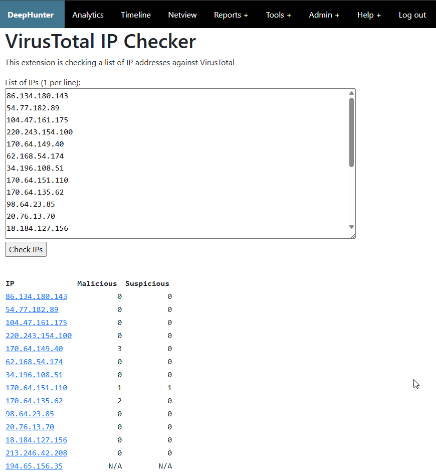

Tools: VirusTotal IP Checker
############################

Description
***********
The VirusTotal (VT) IP Checker is taking a list of IP addresses, submits them to the VirusTotal database, and outputs results in a table with links to VT, whois information (when you mouse over IPs), the number of malicious detections and the number of suspicious detections. 

Configuration
*************
This tool relies on the `VT API key <settings.html#vt-api-key>`_ that you need to configure in the settings.

Notice that no limitation has been configured in the tool. You should check your VT subscription before using this tool.