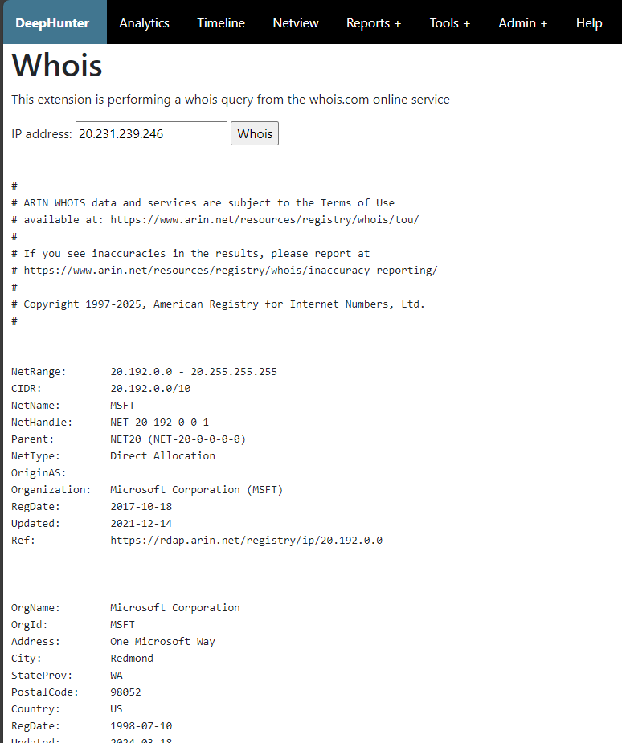

Tools: Whois
############

Description
***********
This tool is performing a Whois query against the whois.com website. Notice that it will fail sometimes due to captcha protections.

Alternative
***********
You may prefer to rely on the `python-whois` package, but be aware that it makes connections to `whois.iana.org` on port 43, which may be blocked in your environment. If you want to do so, you'll need to adapt the code though.