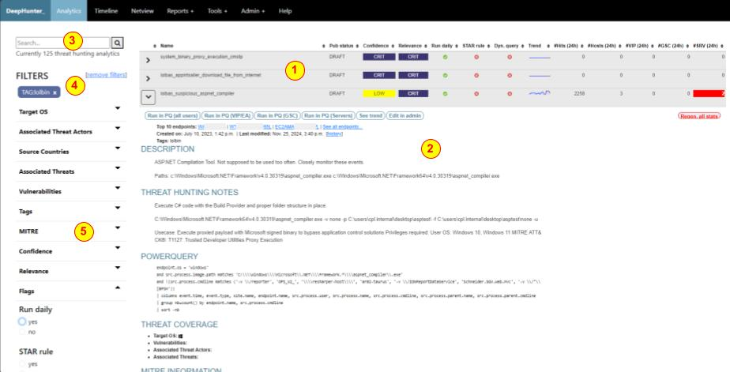

Usage: Analytic
###############

The analytics page is where you will first land once successfully logged in to DeepHunter. This is the main dashboard that shows the list of threat hunting analytics available in DeepHunter. There are many actions you can do from this screen and you can also navigate to other modules.

Interface
*********
Refer to the objects number for details.

1. `List of analytics <#list-of-threat-hunting-analytics>`_
2. `Threat hunting analytic details <#id1>`_
3. `Search form <#id3>`_
4. `Selected filters <#id4>`_
5. `Available filters <#id5>`_

List of threat hunting analytics
********************************
This shows the list of threat hunting analytics available in the DeepHunter database. For each, you will have information shown in columns (clicking on the column header sorts the list):

- **Name**: name of the analytic
- **Pub status**: Publication status (Draft or production)
- **Confidence**: the confidence indicator (CRIT, HIGH, MED, LOW) tells how much you can trust the analytic. If it tends to output many "false positives", the confidence will likely be "LOW". On the other hand, a confidence of "CRIT" means that all matching events are real alerts.
- **Relevance**: The relevance (CRIT, HIGH, MED, LOW) tells how much relevant a threat hunting analytic is, and this is independant from the confidence. It may happen that you have an analytic that matches many events, only some of which are interesting. However, for these latest, the rule is very relevant/significant, and matching events will need to be carefully reviewed.
- **Run daily**: Flag indicating if the analytic is run daily (via the campaigns cron job).
- **STAR rule**: Flag indicating if the analytic has a matching STAR rule in SentinelOne. When you modify an analytic in DeepHunter, always check if this flag is set, as you may also want to reflect the change in the corresponding STAR rule (there is no automatic process).
- **Dyn query**: Flag that indicates if the analytic is static or dynamic (see the `intro page <intro.html>`_ for more information).
- **Trend**: sparkline showing the trend (based on statistics collected by the campaigns) for the last 20 days.
- **Hits (24h)**: Number of matching events for the last 24h, according to the last campaign.
- **Hosts (24h)**: Number of matching unique endpoints for the last 24h, according to the last campaign.
- **Custom fields**: Number of matching unique endpoints for the last 24h, according to the last campaign, with specific filters defined for up to 3 custom fields (defined in the settings).

Threat hunting analytic details 
*******************************

Details of each analytic can be viewed by clicking on the arrow on the left of each analytic name.

Actions buttons
===============

- **Run in PQ (all users)**: Plays the corresponding query in a new window (configured to run a PowerQuery in the SentinelOne EDR). Depending on the interface you use in SentinelOne (legacy or new frontend), you may want to change ``S1_URL`` in the `settings <settings.html#sentinelone-api>`_.
- **Run in PQ (custom_filter)**: Same as the previous button, but with a custom filter, defined in the custom fields (see ``CUSTOM_FIELDS`` property in the `settings <settings.html#custom-fields>`_).
- **See trend**: Opens the `trend analysis page <usage_trend.html>`_.
- **Edit in admin**: Opens the threat hunting in edit mode using the Django admin backend.
- **Regen. all stats**: Regenerates the statistics for the entire retention for the threat hunting analytic. This process runs in the background using Celery/Redis. You can close the page, and the process will continue to run. A percentage of completion is shown in real time.

Header Information
==================

- **top 10 endpoints + see all endpoints**: Shows the list of top 10 endpoints identified by the last campaign. Clicking on an endpoint will open a new window, loaded with the `timeline <usage_timeline.html>`_ of the selected endpoint. If there are more than 10 endpoints, the `see all endpoints` link redirects to the backend to show the full list of endpoints.
- **Created on, last modified on, history**: Date of creation and last modification. The `history` link shows all modifications, user and date for the analytic. It relies on the `django-simple-history` package.
- **Tags**: list of selected tags for the threat hunting analytic.

Sections
========

- **Description**: This is the description of the threat hunting analytic. It uses the markdown syntax to format the text, and possibly add subsections (description, offensive tradecraft, examples, etc.)
- **Threat Hunting Notes**: Shows the threat hunting notes to help threat hunters to triage matches. For example, it can be used to warn about known false positives, or describe some exclusions.
- **PowerQuery**: The PowerQuery, including columns (the query and the columns are in 2 separate fields in the database).
- **Threat Coverage**: shows the OS covered by the threat hunting analytic, vulnerabilities covered, associated threat actors and associated threats. 
- **MITRE Information**: MITRE coverage (tactics, techniques and sub-techniques).
- **Emulation & Validation**: Shows steps to emulate a behavior that will trigger the analytic.
- **References**: a list of links to learn more about the threat hunting analytic.

Search form
***********
Search for a string in the threat hunting analytics names, descriptions and threat hunting notes.

Selected filters
****************
List of applied filters. Click on the cross sign to remove a specific filter.

Available filters
*****************
The list of all possible filters, broken down into sections. Expand a section and select a filter. It will be immediately added to the list of selected filters nad the page will refresh. You can add as many filters as you want. Filters from the same section are applied as a list of values (for example, if you select "Windows" and "Linux" as "Target OS", it will show the list of threat hunting analytics that cover "Windows" or "Linux").